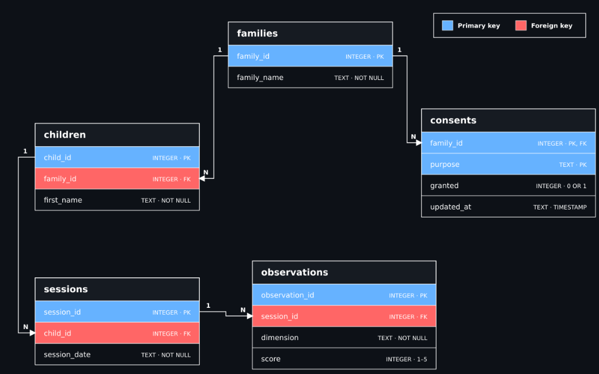

# Family Progress Demo

A small Streamlit application showing how children can be followed across weekly sessions and future months. It gives a family a simple monthly snapshot, suggests when a person should review a pattern, and demonstrates two privacy safeguards.

All names, families, sessions, and scores are invented. The demo contains 6 children, 24 sessions, and 72 observations.

## Run

```bash
# Linux or macOS
python3.11 -m venv .venv
source .venv/bin/activate

# Windows PowerShell
py -m venv .venv
.venv\Scripts\Activate.ps1

python -m pip install -r requirements.txt
python -m streamlit run app.py
```

Run the focused checks with pytest -q.

## Design Principles

- The invented data is provided as CSV so it can be inspected easily, then loaded into SQLite for relational constraints and querying.
- Families, children, sessions, observations, and consent purposes are stored separately to keep the data consistent and extensible.
- Snapshot calculations, follow-up detection, and privacy safeguards are implemented outside the Streamlit interface; the interface only collects selections and presents results.
- Sessions are stored with dates, so future months require new records rather than schema changes.
SQLite keeps the demonstration portable and requires no external database server.

## 1. Storing the Data




Each session belongs to a child and has a date, so following a family into another month only requires adding new sessions and observations. A family can have multiple children, while each child’s progress remains separate.

Observations are stored as dimension-score rows instead of fixed columns. This avoids repeating session information and allows new scored dimensions to be added without changing the session table.

Consent is stored per family and purpose. Withdrawing `research_analytics`, for example, does not change `service_delivery` or `parent_reporting`.

The database enforces:

- Scores between 1 and 5
- Only supported observation dimensions and consent purposes
- One score per dimension in each session
- One consent status per family and purpose
- Valid relationships through foreign keys

See the complete [SQLite schema](sql/schema.sql) and [CSV loading logic](src/database.py).

## 2. Family Snapshot

The user selects a family, child, and month, then sees:

- Sessions attended
- Average score for each observation dimension
- Weekly trends
- A short plain-language summary
- Follow-up status

Each child is shown separately, including siblings in the same family. The result is displayed in **Parent Snapshot** tab in the Streamlit application  

The calculations and summary are produced by the [snapshot logic](src/progress.py) and displayed through the [Streamlit interface](app.py).

## 3. Rule for Contacting the Family

Follow-up is suggested when the same observation dimension is scored **2 or lower in two consecutive sessions**.

A single difficult session may be temporary, while two consecutive low scores in the same area indicate a pattern worth reviewing. The rule prompts a person to consider contacting the family; it does not make a diagnosis or trigger contact automatically.

The demo shows this with Maya’s final two **Settles and recovers** scores. See the [follow-up rule](src/progress.py).

## 4. Additional Measures and Swiss Data Protection

Attendance, observer identity, and a structured context tag may be collected under the Swiss FADP when they are necessary and proportionate to a clearly stated purpose, such as delivering the sessions and producing the family report.

Families must be informed when the data is collected, access must be secured, and records should be retained only for as long as their stated purpose requires.

Optional uses such as research analytics require separate, informed, and voluntary consent that can be withdrawn without affecting service delivery or parent reporting.

## 5. Safeguards

### Independent Consent

Consent is stored separately for each family and purpose using `(family_id, purpose)` as the primary key. Withdrawing research analytics consent therefore changes only that purpose; service delivery and parent reporting remain active.

The **Safeguards** tab demonstrates this with withdraw and restore buttons. See the [consent schema](sql/schema.sql), [database logic](src/database.py), and [Streamlit interface](app.py).

### Minimum Group Size

Before calculating group statistics, the backend excludes children whose families have not granted research analytics consent. If fewer than five eligible children remain, it returns no averages and the interface displays only a suppression message.

The demo starts with six selected children and five eligible children, so averages are displayed. Withdrawing additional consent reduces the eligible group below five and suppresses the result. See the [group summary logic](src/progress.py).

## Future Work

The current structure already supports additional months, multiple children per family, and new observation types without redesigning the core data model. A production version would replace the local CSV and SQLite setup with a persistent database and data-entry pipeline, then add authentication, role-based access, audit logging, and automated retention and deletion processes.

## Folder Structure and Navigation

| Location | Purpose |
| --- | --- |
| app.py | Streamlit interface |
| data | Invented CSV input data |
| sql/schema.sql | SQLite tables and constraints |
| src/database.py | Database setup, CSV loading, and consent updates |
| src/progress.py | Snapshot, follow-up rule, and privacy logic |
| tests/test_core.py | Focused behavior and safeguard tests |
| requirements.txt | Minimal Python dependencies |
